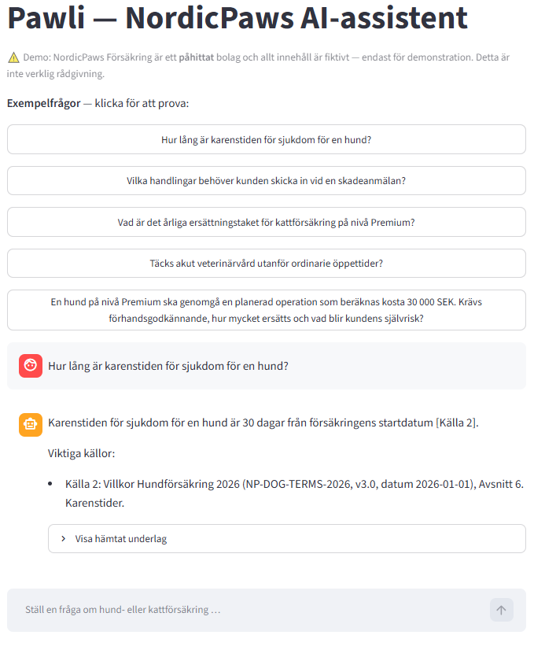

# NordicPaws Försäkring --- Insurance Knowledge Assistant (Pawli v1)

A Swedish RAG demo for **pet-insurance teams**, built with
**LangChain, OpenAI, Chroma, Streamlit, and Python**. The v1 concept is an **internal insurance knowledge copilot**: it helps
customer-service and insurance staff find, interpret, and explain policy
information with traceable source evidence. A future customer-facing
assistant could reuse the same knowledge layer with different guardrails
and escalation workflows.

> ⚠️ **Demo only:** NordicPaws Försäkring is fictional. The documents
> and figures are synthetic and must not be used for real insurance or
> veterinary decisions.

## What it does

The assistant answers Swedish-language questions about:

-   🐕 Dog and 🐈 cat insurance
-   Coverage and reimbursement
-   Deductibles and waiting periods
-   Veterinary care and surgery
-   Claims procedures
-   Exclusions and limitations
-   Policy-based deductible calculations

It provides grounded answers with source references and can expose the
retrieved evidence for employee verification. It also **abstains when the available documents do not contain sufficient evidence**, for example for questions about premium prices or foreign/travel coverage.

## Intended user

The primary v1 user is an **insurance-company employee**, such as a
customer-service or claims-support agent.

A typical workflow is:

``` text
Customer question
      ↓
Insurance employee
      ↓
NordicPaws assistant
      ↓
Relevant policy evidence
+ grounded explanation
+ calculation when applicable
+ traceable sources
      ↓
Employee verifies
      ↓
Customer receives final answer
```

The employee remains responsible for the final customer communication or
insurance decision. NordicPaws is a decision-support and
knowledge-retrieval prototype, not an autonomous claims-decision system.

## Current status

-   ✅ 6 synthetic Swedish insurance documents
-   ✅ 58 indexed chunks in Chroma
-   ✅ Structure-aware Markdown chunking
-   ✅ Metadata and source citation recording
-   ✅ Swedish grounded-generation prompt
-   ✅ Evidence-based abstention behavior
-   ✅ Streamlit chat interface
-   ✅ Retrieved-evidence inspection in the UI
-   ✅ 12-question golden evaluation set
-   ✅ Source-pair retrieval evaluation
-   ✅ Atomic key-fact answer evaluation
-   ✅ Structured calculation-output evaluation
-   ✅ Automatic detection of incorrect, missing, and ambiguous
    calculation outputs
-   ✅ Deterministic dog/cat species filtering
-   ✅ Targeted deductible-mechanics evidence supplementation
-   ✅ Automated test suite
-   ⚠️ Complex multi-part questions can still miss relevant policy
    sections
-   ⚠️ The evaluation set is intentionally small and synthetic

## Retrieval and generation strategy

The v1 system deliberately uses a relatively simple retrieval
architecture rather than adding multiple LLM-based routing or reranking
stages. The default pipeline uses:

-   OpenAI `text-embedding-3-small` embeddings
-   Chroma vector storage
-   Dense retrieval with `k=8`
-   Deterministic species filtering to reduce dog/cat
    cross-contamination
-   Targeted evidence supplementation for deductible calculations when
    the deductible-mechanics section is missing
-   Grounded Swedish answer generation
-   Evidence-based abstention when the documents do not support an
    answer

Query decomposition was explored experimentally but was **not selected
as the v1 default** because it did not consistently outperform the
simpler baseline under the evaluation setup.

## Evaluation

The evaluation harness separates **retrieval quality**, **answer quality**, **behavior**, and **calculation correctness**. Retrieval is evaluated using expected `(document_id, section)` source pairs. Answer quality is evaluated using expected behavior and atomic key facts. Numeric questions additionally use structured
calculation-output checks.

### Recorded v1 evaluation run

The results below are from one recorded evaluation run. Although the generation and judge models use temperature=0.0, LLM outputs are not guaranteed to be deterministic, so individual answer-quality and semantic-evaluation results may vary between runs. Retrieval results are more stable where the index and configuration remain unchanged.

``` text
Chat model:       gpt-4o-mini
Embeddings:       text-embedding-3-small
Temperature:      0.0
Retrieval k:      8
Golden questions: 12
```

```
  Metric                                            Result
  ------------------------------------ -------------------
  Behavior match                              12/12 (100%)
  Answerable questions answered               10/10 (100%)
  Correct abstentions                           2/2 (100%)
  Complete expected source retrieval            8/10 (80%)
  Expected source-pair recall                  17/20 (85%)
  Answer correctness                            8/10 (80%)
  All expected key facts supported              8/10 (80%)
  Key-fact recall                            22/26 (84.6%)
  Calculation correctness                       3/3 (100%)
```

The remaining answer failures are within some complex multi-part questions (e.g., **Q6** and **Q7** in `eval/golden_qa.jsonl`) where dense retrieval does not consistently surface every policy section needed to establish all expected facts.

Notably, these figures come from a **small synthetic development benchmark**.
They are useful for regression testing and engineering diagnostics, but
they should not be interpreted as estimates of production accuracy on
real insurance questions.

## Architecture

``` text
Synthetic Swedish insurance documents
                ↓
          Markdown loader
                ↓
     Structure-aware chunking
                ↓
        OpenAI embeddings
                ↓
          Chroma database
                ↓
       Dense retrieval (k=8)
                ↓
   Deterministic species filtering
                ↓
        ┌───────┴────────┐
        │                │
 Ordinary question   Deductible calculation
        │                ↓
        │        Deductible-mechanics
        │          evidence check
        │                ↓
        │        Supplement if missing
        └───────┬────────┘
                ↓
        Grounded Swedish LLM
                ↓
     Answer + citations / abstention
                ↓
          Streamlit interface
                +
             Evaluation
       ├── behavior
       ├── source-pair recall
       ├── key-fact recall
       └── calculation correctness
```

## Deterministic safeguards

Pure semantic retrieval can retrieve semantically similar but operationally incomplete evidence, especially for multi-part insurance questions. Rather than a collection of question-specific rules, the v1 prototype therefore uses narrow deterministic safeguards where they are easy to justify:

1.  **Species filtering** prevents a dog-specific question from being
    answered using cat policy terms, and vice versa.
2.  **Deductible-mechanics supplementation** ensures that deductible
    calculations have access to both the applicable values and the rules
    describing how fixed and variable deductibles are applied.
3.  **Abstention** is preferred when the retrieved evidence is
    insufficient.

## Project structure

``` text
insurance-knowledge-assistant/
├── data/
│   └── insurance_docs/
├── src/
│   ├── config.py
│   ├── ingest/
│   ├── retrieval/
│   ├── generation/
│   ├── evaluation/
│   └── ui_format.py
├── eval/
│   ├── golden_qa.jsonl
│   └── run_eval.py
├── scripts/
│   ├── inspect_retrieval.py
│   └── compare_retrieval.py
├── tests/
├── app.py
├── .env.example
└── requirements.txt
```

## Run

Create a virtual environment and install dependencies:

``` bash
pip install -r requirements.txt
```

Create `.env` from the example file and add your `OPENAI_API_KEY`:

``` bash
cp .env.example .env
```

Run tests:

``` bash
pytest -q
```

Build the vector index:

``` bash
PYTHONPATH=src python -m ingest.build_index
```

Run retrieval-only diagnostics for selected questions:
```bash
PYTHONPATH=src python scripts/inspect_retrieval.py
```

Compare baseline dense vs decomposed retrieval:
```bash
PYTHONPATH=src python scripts/compare_retrieval.py
```

Run the full evaluation harness:

``` bash
PYTHONPATH=src python eval/run_eval.py
```

Launch the Streamlit demo:

``` bash
streamlit run app.py
```



> On Windows PowerShell, set `PYTHONPATH` separately before running
> commands if the Unix-style inline syntax is not supported.

## Limitations

-   The corpus and golden evaluation set are synthetic and small.
-   Dense retrieval can miss some evidence for questions spanning
    several independent policy concepts.
-   It does not replace employee verification of policy terms.
-   The prototype has not undergone production security, privacy,
    regulatory, latency, or load testing.

## Next steps

The next phase is **customer validation and further benchmark optimization**.

Priority activities:

1.  Identify the highest-value workflow: customer service, claims
    support, internal policy search, onboarding/training, or another use
    case.
2.  Learn what document systems, auditability, permissions, security,
    and response-time requirements a real insurer would impose.
3.  Expand the evaluation set using realistic questions derived from
    validated workflows.
4.  Evaluate v2 improvements such as BM25, hybrid retrieval,
    reranking, deterministic policy-rule extraction, enterprise document
    ingestion, authentication, and human escalation.
5.  Explore a separate customer-facing mode if customer discovery
    shows sufficient value and appropriate safety controls can be
    implemented.

## Disclaimer

NordicPaws Försäkring and all associated policy documents, limits,
deductibles, examples, and evaluation questions in this repository are
fictional and synthetic. The project is intended solely for software
engineering, RAG evaluation, and product-prototyping purposes.
